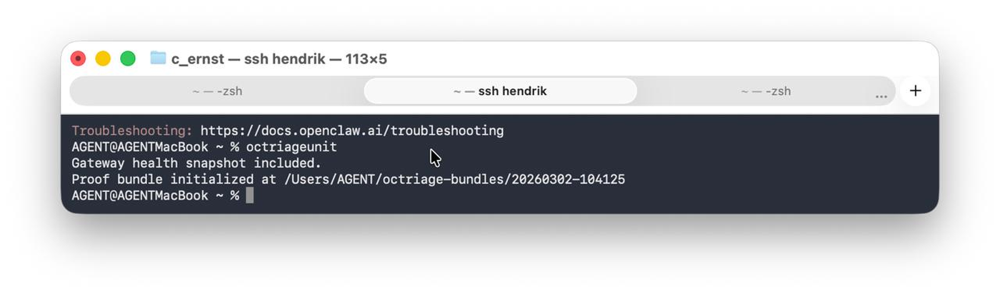

# OCTriageUnit

**Control-plane triage for OpenClaw deployments.**

OCTriageUnit is a lightweight diagnostic tool that captures a proof bundle when the OpenClaw gateway is degraded or unreachable. It is designed to run safely — without touching any live service — even when the control plane is completely down.

---

## Safety Guarantees

- **Read-only** — never modifies system state, config, or service registrations
- **No telemetry** — zero outbound network calls of any kind
- **Local-only** — all execution happens on the operator machine
- **Proof bundle output** — writes only to `~/octriage-bundles/`
- **Auditable source** — `cat /usr/local/bin/octriageunit` shows the full script

---

## Usage

```bash
octriageunit               # run triage, initialize proof bundle
octriageunit --self-test   # verify syntax and flags
octriageunit --version     # print version
octriageunit --help        # print safety guarantees + usage
```

---

## Example Run

The following shows OCTriageUnit running during a live gateway failure. The tool captures a health snapshot and initializes a proof bundle — then exits cleanly with no service modification.



**What the output means:**

| Line | Meaning |
|------|---------|
| `Gateway health snapshot included.` | A `gateway_health.txt` snapshot was found and copied into the bundle |
| `Proof bundle initialized at ~/octriage-bundles/<timestamp>` | Artifacts are ready for inspection or support escalation |

> **Designed to run when the control plane is degraded.** OCTriageUnit does not require the gateway to be healthy to execute.

---

## Health Verification

When the gateway is healthy, `openclaw doctor` (or a direct port probe) returns three key signals:

```
Runtime: running (pid <N>)
RPC probe: ok
Listening: 127.0.0.1:18789
```

If all three lines appear, the gateway is healthy and accepting local connections.

**What each signal means:**

| Signal | Meaning |
|--------|---------|
| `Runtime: running (pid N)` | The gateway process is alive |
| `RPC probe: ok` | Internal RPC endpoint responding |
| `Listening: 127.0.0.1:18789` | Gateway bound to the configured port |

If any of these are missing or show errors, run `octriageunit` to capture a proof bundle before attempting any restart.

---

## Proof Bundle Contents

Each run produces a timestamped directory under `~/octriage-bundles/`:

```
~/octriage-bundles/20260302-104125/
├── bundle_summary.txt       # run metadata
├── state_snapshots/watchdog_disk_usage.txt # read-only watchdog du snapshot
├── gateway_health.txt       # gateway health snapshot (if available)
├── gateway_health.json      # structured health data
├── gateway_err_tail.txt     # recent gateway error log tail
├── launchctl_snapshot.txt   # launchd service state
├── doctor_output.txt        # openclaw doctor output
└── manifest.sha256          # SHA-256 checksums of all artifacts
```

Bundle contents are safe to share with support. No credentials, tokens, or config secrets are included.
Bundle metadata now includes a watchdog footprint note and `watchdog_bloat_warning=true` when `du -sh ~/.openclaw/watchdog` exceeds 500M.

---

## Trust Model

OCTriageUnit follows the [OCTriageUnit Trust Doctrine](octriageunit-trust-doctrine.md):

- No hidden behavior
- No background daemons installed
- No LaunchAgent writes
- Future features are inert by default until operator-activated

```
OCTriageUnit (free wedge)  →  visibility
Sentinel                   →  reliability (first paid attach)
Agent911                   →  recovery + control plane
```

---

## Requirements

- macOS (bash 3.2+)
- `launchctl` (standard macOS)
- `openclaw` CLI on PATH
- `shasum` for manifest generation (standard macOS)

---

## Version

```bash
octriageunit --version
```

Current: `0.1.0`

---

*Owner: Hendrik / GP-OPS | Trust Doctrine: 2026-02-28*
